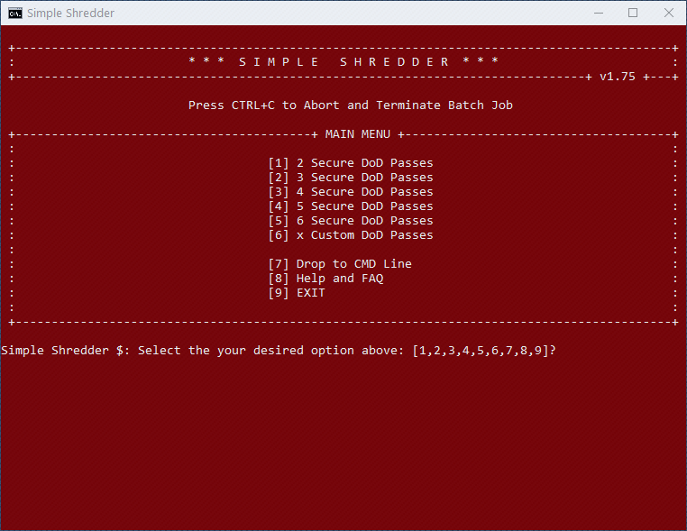
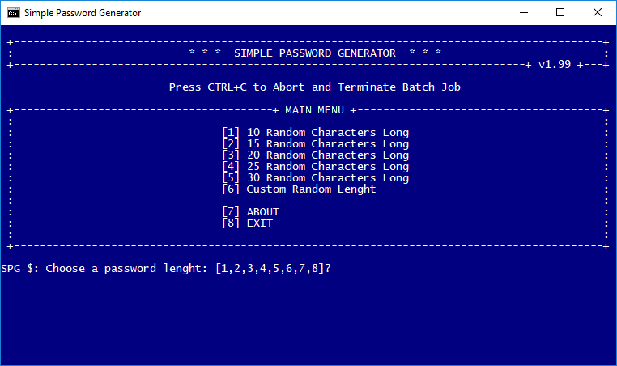

<h1 align="center"><strong>Welcome to Batch-101</strong></h1>

## About - Simple Shredder

This small batch file, leverages the power of SDelete in order to shred files or folders dragged and dropped onto the Simple Shedder icon.

Simple Shredder is menu driven and offers a few options, at this time, it allows the user to decide between 2 to 6 or a custom number of passes that SDelete will use to shred your files into oblivion, likely for all time :).

Once you download and extract the SDelete binaries into the Simple Shredder directory, you're set to go. Simple Shredder automatically uses the correct SDelete binary bitness 32-bit/64-bit which is system dependant.

Just drag and drop Files or Folders and their contents onto the Simple Shredder icon to begin. Simple!

SDelete is developed by Mark Russinovich ans is part of sysinternals suite.  
Information about SDelete can be found [here](https://docs.microsoft.com/en-us/sysinternals/downloads/sdelete)



### Instructions

* Download SDelete from [here](https://live.sysinternals.com/Files/SDelete.zip "SDelete 32-bit/64-bit")
* Extract the SDelete binaries into the Simple Shredder directory.
* Drag and Drop files or folders onto the Simple Shredder.bat

#### Pretty Simple Shredder Icon

* You can also create a shortcut to the ```Simple Shredder.bat``` and assign the icon provided to the shortcut.  
  Dragging and Dropping items onto the shortcut works the same way.

The Icon provided is a design by [Mateusz Dembek](https://dribbble.com/shots/582476-Mail-icons-pack)

[](LICENCE)  

---

## About - Simple Password Generator

This small batch file, generates complex passwords from a preset range lenght of 10 to 30 characters long or from a custom user defined lenght.

It allows you to save your password to a text file which is stored to wherever path the batch file is, along with a reference tied to the password for you to at any time access.

If this path is a USB drive your passwords will be safe as long as you take simple precautions.

#### How Strong Are My Passwords

You can find out how strong your passwords are [here](https://www.grc.com/haystack.htm)



:warning: **Warning** The Simple Password Generator **empties your clipboard** on every password regeneration or when it exits.

[](LICENCE)
