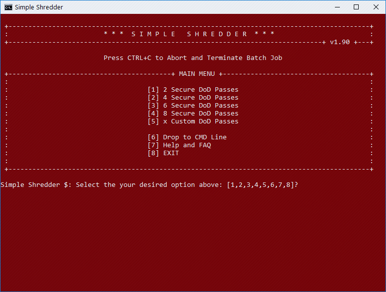
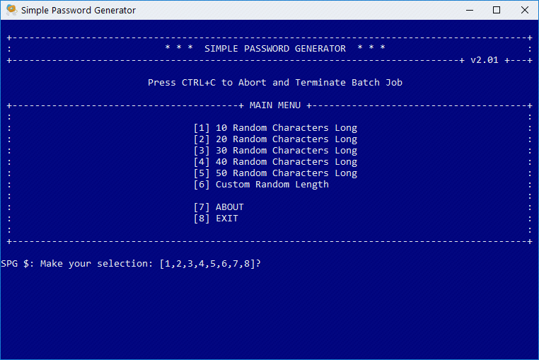

<h1 align="center"><strong>Welcome to Batch-101</strong></h1>

## About - Simple Shredder

This small batch file, leverages the power of SDelete in order to shred files or folders dragged and dropped onto the Simple Shedder icon.

Simple Shredder is menu driven and offers a few options, at this time it allows the user to decide between the prest range between 2 to 8 or a custom number of passes that SDelete will use to shred your files into oblivion, likely for all time :).

Once you download and extract the SDelete binaries into the Simple Shredder directory, you're set to go. Simple Shredder automatically uses the correct SDelete binary bitness 32-bit/64-bit which is system dependant.

Just drag and drop Files or Folders and their contents onto the Simple Shredder icon to begin. Simple!

SDelete is developed by Mark Russinovich and is part of sysinternals suite.  
Information about SDelete can be found [here](https://docs.microsoft.com/en-us/sysinternals/downloads/sdelete)

### Instructions

* Download your SDelete binaries from [here](https://live.sysinternals.com/Files/SDelete.zip "SDelete 32-bit/64-bit")
* Extract the SDelete binaries into the Simple Shredder directory.
* Drag and Drop files or folders onto the Simple Shredder.bat

#### Pretty Simple Shredder Icon Shortcut

* You can also create a shortcut to the `Simple Shredder.bat` and assign the icon provided to the shortcut.  
  Dragging and Dropping items onto the shortcut works the same way.

The Icon provided is a design by [Mateusz Dembek](https://dribbble.com/shots/582476-Mail-icons-pack)

  

---

## About - Simple Password Generator

:warning: **Warning** The Simple Password Generator **empties your clipboard** on every password regeneration or when it exits.

This small batch file, generates complex passwords from a preset range length of 10 to 50 characters long or from a custom user defined length no more than 999 characters

Your password are saved to a text file with an optional reference to make it easy to remember the associated device/account/wifi etc. to the corresponding password
The *Simple-Password-Generator-List.txt* is created if it doesn't exist and if it exists all passwords are appended to it.
The *Simple-Password-Generator-List.txt* is stored to wherever path/location the batch file is, along with a reference/date/time tied to the password for you to at any time access.

If this path is a USB drive your passwords will be safe as long as you take simple precautions.

I recommend you use an external storage device like USB for this purpose

From version 2.02 Generated passwords are compliant with DD-WRT

#### How Strong Are My Passwords

For curiosity find out how potentially strong your passwords are [here](https://www.grc.com/haystack.htm)

## WARRANTY

Read [the relevant part](https://github.com/the-j0k3r/batch-101/blob/8eace2781a028f888468bb0eef8c853f6864d493/LICENCE#L260-L278) of the License.
